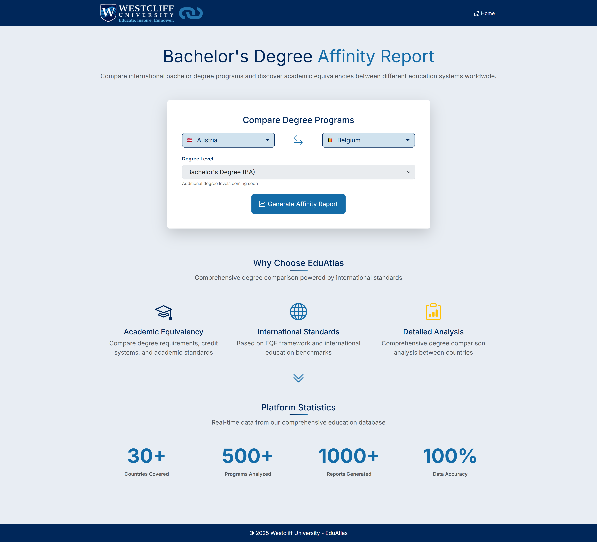
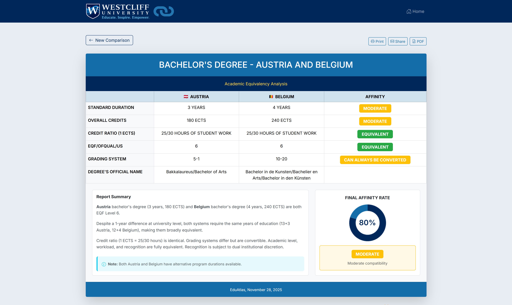
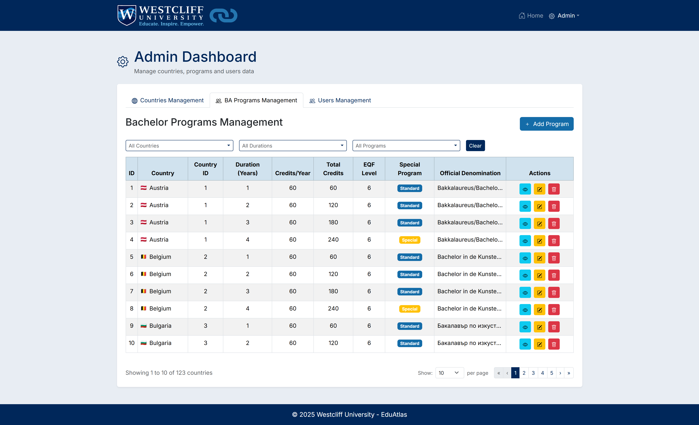

# 🎓 EduAtlas - Degree Affinity Report System

       

The **EduAtlas Affinity Report System** is a Full Stack Capstone project developed for **Westcliff University**. It addresses a specific administrative challenge: comparing international **Bachelor's degree programs** to determine academic compatibility between different education systems.

The system automates the analysis of degree durations, ECTS credits, credit ratios, and EQF levels to generate a calculated **"Affinity Score"** and a downloadable PDF report.

---

## 🔗 Live Demo & Documentation

| Component       | Link                                                                                                    | Status    |
| :-------------- | :------------------------------------------------------------------------------------------------------ | :-------- |
| **🚀 Live App** | [**https://eduatlas-affinity-report.netlify.app**](https://eduatlas-affinity-report.netlify.app)        | 🟢 Online |
| **⚙️ API Docs** | [**Swagger UI (Backend)**](https://extraordinary-greer-ictech-3392249e.koyeb.app/swagger-ui/index.html) | 🟢 Online |

_(Note: The backend is hosted on a free tier. Please allow ~30 seconds for the server to wake up on the first request.)_

---

## 📸 Application Gallery

### 🌍 Public User Flow

**1. Country Selection**
_The homepage features a responsive interface where users select two countries to begin the comparison._



**2. Affinity Report Generation**
_The system generates a detailed comparison table, calculates the affinity score, and visualizes the data._



---

### 🔐 Admin & Management Flow

**3. Secure Authentication**
_A dedicated `/login` portal protects the administrative area using JWT credentials._


**4. Admin Backoffice**
_Authenticated admins can browse, search, edit, or delete countries data, bachelor programs data and users data via a comprehensive dashboard._



---

## 🧠 Under the Hood: The Data Engine

One of the technical highlights of this backend is the **Custom Data Ingestion Engine**.

The source data was provided as a complex, non-standard Excel matrix. **Instead of manually cleaning the Excel file to make it "easy" to import, I chose to engineer a robust parser.** This architectural decision was made to challenge myself to handle raw, unstructured real-world data programmatically.

- **Smart Parsing:** Uses `Apache POI` and custom **Regex logic** to interpret complex grading scales (e.g., dynamically parsing "1|6" into "1-6").
- **Business Logic:** Handles specific edge cases via code, such as detecting and adapting Poland's unique 3.5-year engineering degrees directly during the import process.
- **Normalization:** The engine converts the raw Excel cells into normalized `Country` and `BachelorProgram` database entities, automatically calculating missing ECTS values based on duration logic.

---

## ✨ Key Features

- **Comparison Algorithm:** Calculates compatibility percentages based on Duration, Credits, EQF Level, and Credit Ratios.
- **Export Tools:** Generate PDF reports using `html2canvas` and `jspdf`.
- **Secure Admin API:** Full CRUD capabilities protected by Spring Security & JWT.
- **Feedback System:** Integrated user reporting tool.

---

## 🛠️ Tech Stack

### Frontend

- **Library:** React 19
- **Build Tool:** Vite 7
- **Styling:** React Bootstrap 5, SASS
- **Routing:** React Router
- **HTTP Client:** Axios
- **Visualization:** Chart.js (React-Chartjs-2)
- **Utils:** JWT-Decode, HTML2Canvas, JSPDF
- **Deploy:** Netlify

### Backend

- **Framework:** Java 21, Spring Boot 3.2
- **Security:** Spring Security, JWT, CORS
- **Database:** PostgreSQL (Hosted on Koyeb)
- **Documentation:** OpenAPI 3 (Swagger UI)
- **Deploy:** Koyeb (Cloud Native Buildpacks)

### Tools

- **Testing:** Postman
- **Version Control:** Git / GitHub

---

## 🏃‍♂️ How to Run Locally

### Prerequisites

- Node.js 18+
- Java JDK 21
- PostgreSQL (running locally or accessible remotely)
- Git

### 1. Clone the repository

```bash
git clone https://github.com/ivancroce/eduatlas-affinity-report.git
cd eduatlas-affinity-report
```

### 2. Backend setup (Java / Spring Boot)

Create the backend environment file `backend/.env.properties` with at least these values (adjust for your DB):

```properties
SERVER_PORT=3001
PG_USERNAME=postgres
PG_PASSWORD=your_password
JDBC_URI=jdbc:postgresql://localhost:5432/eduatlas_affinity_report_db
JWT_SECRET=your_very_long_random_secret_string
JWT_EXPIRATION=86400000
admin.username=admin
admin.email=admin@example.com
admin.password=your_admin_password
admin.first-name=Admin
admin.last-name=User
# Mailgun Configuration (Optional for the feedback)
MAILGUN_API_KEY=x
MAILGUN_DOMAIN_NAME=x
MAILGUN_SENDER_EMAIL=x
```

Run the backend:

- On Windows (Command Prompt / PowerShell):

```powershell
cd backend
.\mvnw.cmd spring-boot:run
```

- On macOS / Linux / Git Bash:

```bash
cd backend
./mvnw spring-boot:run
```

The backend will be available at http://localhost:3001 (adjust SERVER_PORT if changed).

### 3. Frontend setup (React / Vite)

Open a new terminal, install dependencies and set the API base URL.

From project root:

```bash
cd frontend
npm install
```

Create a Vite env file (`frontend/.env`) — Vite requires variables prefixed with VITE\_:

- bash:

```bash
echo "VITE_API_BASE_URL=http://localhost:3001/api" > .env
```

- PowerShell:

```powershell
Set-Content -Path .env -Value 'VITE_API_BASE_URL=http://localhost:3001/api'
```

Start the dev server:

```bash
npm run dev
```

Build for production:

```bash
npm run build
npm run preview   # preview the production build locally
```

---

## 🌐 Local URLs

| Service  | URL                                         |
| :------- | :------------------------------------------ |
| Frontend | http://localhost:5173                       |
| Backend  | http://localhost:3001                       |
| Swagger  | http://localhost:3001/swagger-ui/index.html |

## ☁ Deployment Architecture

React (Netlify)  
↓  
Spring Boot API (Koyeb)  
↓  
PostgreSQL (Koyeb)

### SPA routing (Netlify)

Place a `_redirects` file in the frontend public/build root so client routes resolve to index.html after deploy:

_frontend/public/\_redirects_ (or ensure it ends up in the publish directory)

```
/* /index.html 200
```

> Note: For Vite the publish output is `dist`. If you keep `_redirects` in `frontend/public`, Vite will copy it to `dist` during build.

---

## ⚖️ Disclaimer

This project was developed strictly for educational purposes as a Capstone Project for Westcliff University. The EduAtlas branding, UI concepts, and system logic are part of an academic demonstration only. The tool is not intended for commercial use or real academic evaluation.

## 👨‍💻 Author

Ivan Croce  
Junior Full Stack Developer
Capstone Project for EduAtlas - Westcliff University

### 📝 Notes

- Ensure your backend API base matches the frontend env var (VITE_API_BASE_URL). The frontend axios instance reads that env var.
- If you deploy to Netlify, include `_redirects` or `netlify.toml` in the production build output so client-side routes work on refresh.
